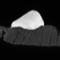
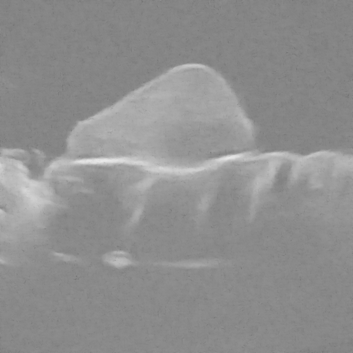
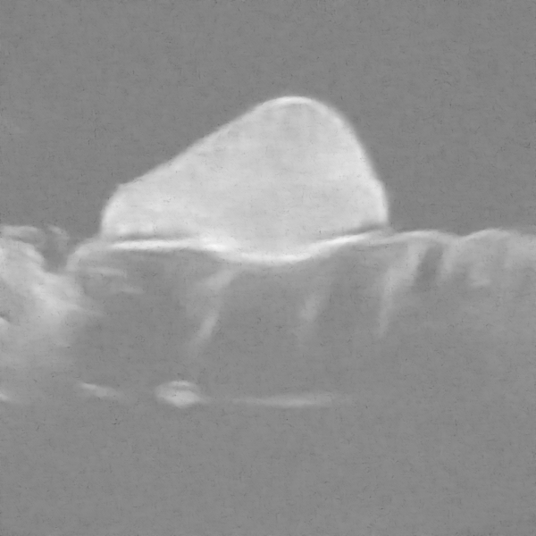
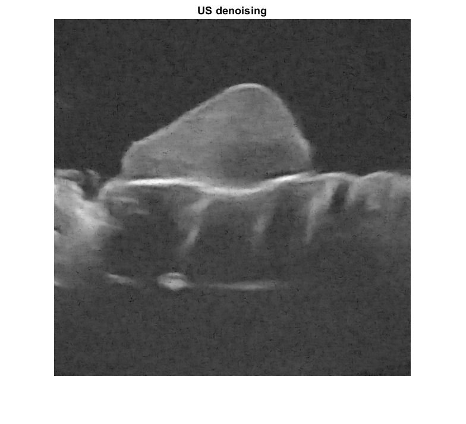
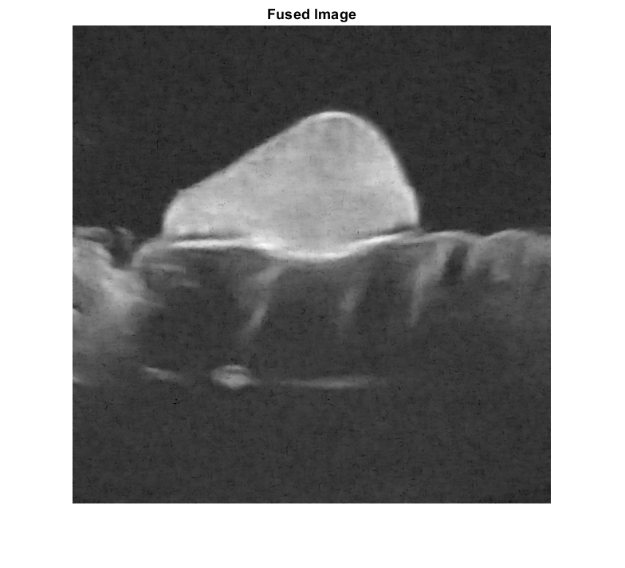

# Fusion of Magnetic Resonance and Ultrasound Images for Endometriosis Detection

This repository is an presentation of the Proximal Alternating Linearized Minimization algorithm for image fusion, as describe in the article [Fusion of Magnetic Resonance and Ultrasound Images for Endometriosis Detection](https://ieeexplore.ieee.org/document/9018380). This article was written by Oumaima El Mansouri during her three-year PhD in signal, image, acoustics and optimisation. For interested readers, the full thesis is available [here](https://theses.hal.science/tel-04172488v1/file/El_-_mansouri_Oumaima.pdf). Since Oumaima El Mansouri, the original author of the article, did not submit their research work to a Github repository, we are presenting it here.

## Abstract
This paper introduces a new fusion method for magnetic resonance (MR) and ultrasound (US) images, which aims at combining the advantages of each modality, i.e., good contrast and signal to noise ratio for the MR image and good spatial resolution for the US image. The proposed algorithm is based on an inverse problem, performing a super-resolution of the MR image and a denoising of the US image. A polynomial function is introduced to model the relationships between the gray levels of the MR and US images. The resulting inverse problem is solved using a proximal alternating linearized minimization algorithm. The accuracy and the interest of the fusion algorithm are shown quantitatively and qualitatively via evaluations on synthetic and experimental phantom data.

## Experimental data
In the article, we gave an illustration of the experimental model. We used a slice of beef steak of size 17 $\times$ 10 $\times$ 1.5 cm. On the top of wich was stuck a polyvinyl alcohol phantom (PVA), using cyanoacrylate instant glue. The phantom was created by using a spheroid plastic mold measuring 4.3 $\times$ 3 $\times$ 1.5 cm. The phantom substance was based on a mixture of deionized water (89%), PVA (10%, Sigma-Aldrich) and silica (1%, Sigma-Aldrich). Water was heated until 90°C. PVA was added slowly and dissolved using magnetic stirring (500 to 700 rpm during 1 hour). Silica was added just after PVA was fully solubilized. The prepared solution was then poured into the mold and submitted to freeze-thaw cycles until solidification.

We obtain two images modalities : magnetic resonance imaging (MRI) and ultrasound imaging (US).
<p align="center">
  
  
</p>

In clinical practice, these two imaging modalities are complementary for the assessment of endometriosis, for example (MRI for sensitivity, ultrasound for specificity and depth of infiltration). In this sense, we want to merge these two imaging modalities in order to combine their advantages and, at the same time, eliminate their disadvantages. In the case of MRI and ultrasound, we seek to reduce ultrasound noise (using MRI) by increasing MRI resolution (using ultrasound). These two medical imaging modalities are completely different, both in terms of the acquisition process and the methods used. This is the challenge we face. We assume that the two images we want to merge are geometrically aligned, i.e. superimposable and of the same size.

We use a denoising convolutional neural networks (DnCNN) to denoise the ultrasounds image with the checkpoint `sigma=25.mat` available in the file `models`. 

<p align="center">
  
  
</p>

## Algorithm

We can now merge the two images using the following algorithm.

```pseudo
Input : Denoised US image, MRI image, hyperparameters
Ouput : Fused Image
Resize the MRI image to the size of the ultrasound image by super-resolution
Denoise US image with DnCNN 
While the convergence criterion is satisfied :
    Update MRI image (x1)
          Analytical resolution with FSR_xirm_NL
          Convolution in the Fourier domain via HXconv
          Adjusting MRI (x1) by measuring the deviation with ultrasound (x2) using the derivative of the polynomial approximation
    Update US image (x2)
          Gradient descent with Descente_grad_xus_NL
          Minimising the discrepancy between the US image (x1) and the projected image f(x1)
          Inclusion of adjustment terms (data fidelity, total variation).
End
```

- Analytical resolution

$$\arg\min\limits_{x_1\in\mathbb{R}^N}\big\|y_m - SCx_1\big\|^2 + TV(x_1) + \tau_4\big\|x_2 - \chi(x_1)\big\|^2$$

The two-dimensional Fourier transform is used to solve the linear system.

- Gradient descent

$$\arg\min\limits_{x_2\in\mathbb{R}^N}\underbrace{\sum \left(e^{y_u - x_2} - \gamma(y_u - x_2) \right)}_{\text{log-Rayleigh}} + \tau_2\big\|\nabla x_2\big\|^2 + \tau_3 \big\|x_2 - \chi(x_1)\big\|^2$$

## Result

<p align="center">
  
</p>

Run the `Demo.m` file to obtain these results.

## Display problem

Clarification of certain aspects of Matlab : when saving results via Visual Studio Code, the saved images are inexplicably different from the figures displayed by Matlab. As I am not very familiar with the intricacies of Matlab, I wanted to point out this important aspect. This difference is effective with the denoised US image and the fused image.

- Denoised US image :
<p align="center">
  
  
</p>

- Fused image :
<p align="center">
  
  
</p>

Please let me know if you know what might be causing this noticeable difference.

## Tree view

```plaintext
Fusion-of-Magnetic-Resonance-and-Ultrasound-Images-for-Endometriosis-Detection/
├── images/
│   ├── Data1/          # Images used as illustrations in Readme
│   │   ├── fusion.png
│   │   ├── fusion_figure.png
│   │   ├── irm.mat
│   │   ├── irm.png
│   │   ├── mri_super_resolution.png
│   │   ├── mri_super_resolution_figure.png
│   │   ├── us.mat
│   │   ├── us.png
│   │   ├── us_denoising.png
│   │   └── us_denoising_figure.png
│   ├── Data2/
│   │   ├── IRM_GT.mat
│   │   ├── IRM_GT.png
│   │   ├── IRM_observed.mat
│   │   ├── IRM_observed.png
│   │   ├── US_GT.mat
│   │   ├── US_GT.png
│   │   ├── US_observed.mat
│   │   ├── US_observed.png
│   │   ├── fusion_GT.png
│   │   └── fusion_observed.png
│   └── Data3/
│   │   ├── IRM_GT.mat
│   │   ├── IRM_GT.png
│   │   ├── IRM_observed.mat
│   │   ├── IRM_observed.png
│   │   ├── US_GT.mat
│   │   ├── US_GT.png
│   │   ├── US_observed.mat
│   │   ├── US_observed.png
│   │   ├── fusion_GT.png
│   │   └── fusion_observed.png
├── models/
│   └── sigma=25.mat
├──synthetics/
│   ├── images/
│   │   ├── Data1/
│   │   │   ├── irm.mat
│   │   │   ├── irm.png
│   │   │   ├── us.mat
│   │   │   ├── us.png
├── fusion_matlab.jpg
│   │   ├── init_mi256_2.mat
│   │   └── irm_simu.PNG
│   ├── utils/
│   │   ├── Descente_grad_xus_NL.m
│   │   ├── FSR_xirm_NL.m
│   │   ├── FusionPALM.m
│   │   ├── HXconv.m
│   │   ├── Link.m
│   │   ├── d1.m
│   │   ├── d2.m
│   │   ├── dtd.m
│   │   ├── f1_NL.m
│   │   └── grad_f1_NL.m
│   ├── Demo.asv
│   ├── Synthetic1.asv
│   ├── Synthetic1.m
│   ├── Synthetic2.m
│   ├── demo.m
│   └── estimate_c.m
├── utils/
│   ├── Descente_grad_xus_NL.m
│   ├── FSR_xirm_NL.m
│   ├── FusionPALM.m
│   ├── HXconv.m
│   ├── Link.m
│   ├── d1.m
│   ├── d2.m
│   ├── dtd.m
│   ├── f1_NL.m
│   └── grad_f1_NL.m
├── Demo.m          # Main file
├── Demo_unidim.m
├── README.md
└── estimate_c.m           
```

## Synthetics folder

The folder named `Synthetics` has been used to generate dataset 2 and datased 3. 

## Python version of PALM algorithm

A translation in Python of the code is available [here](https://github.com/TLongin/Denoising-Diffusion-model-with-Proximal-Alternating-Linearized-Minimization). I translated this code into Python myself so that it could be used in a larger and more complicated Python code, which is a diffusion model for multi-modal image fusion.

## References

The `HXconv` function has been made by Ningning Zhao and it is available on her [Github repository](https://github.com/ning22/Fast-Single-Image-Superresolution).

## Citations
If you use the code or dataset, please cite the papers as below :
```bibtex
@article{9018380,
  author={El Mansouri, Oumaima and Vidal, Fabien and Basarab, Adrian and Payoux, Pierre and Kouamé, Denis and Tourneret, Jean-Yves},
  journal={IEEE Transactions on Image Processing}, 
  title={Fusion of Magnetic Resonance and Ultrasound Images for Endometriosis Detection}, 
  year={2020},
  volume={29},
  number={},
  pages={5324-5335},
  keywords={Spatial resolution;Magnetic resonance imaging;Image fusion;Diseases;Magnetic resonance;Image fusion;magnetic resonance imaging;ultrasound imaging;super-resolution;despeckling;proximal alternating linearized minimization},
  doi={10.1109/TIP.2020.2975977}}

@phdthesis{elman2020,
url = "http://www.theses.fr/2020INPT0137",
title = "Fusion of magnetic resonance and ultrasound images for endometriosis detection",
author = "El Mansouri, Oumaima",
year = "2020",
note = "Thèse de doctorat dirigée par Basarab, AdrianTourneret, Jean-Yves et Kouamé, Denis Signal, Image, Acoustique et Optimisation Toulouse, INPT 2020",
note = "2020INPT0137",
url = "http://www.theses.fr/2020INPT0137/document",
}
```
